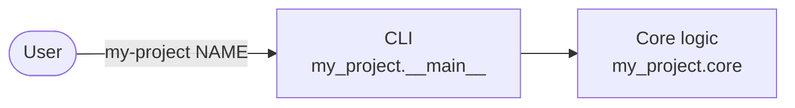

# Architecture overview

> Living document: keep it short, current, and linked to the ADRs that justify
> each decision. The structure loosely follows [arc42](https://arc42.org/overview).

## 1. Goals and constraints

- **Purpose:** what problem does my-project solve, and for whom?
- **Quality goals:** the top three (for example correctness, performance,
  operability) and how each one is measured.
- **Constraints:** Python 3.14+, organisational or regulatory rules, mandatory
  integrations.

## 2. Context

Who and what interacts with the system. Replace the example diagram.

## 3. Building blocks

| Module | Responsibility |
| --- | --- |
| `my_project.__main__` | Command-line interface: parses arguments, prints results, maps errors to exit codes. |
| `my_project.core` | Domain logic, free of I/O so it is easy to unit-test. |

## 4. Runtime view

The important flows, ideally with one sequence diagram per flow.

## 5. Deployment

How the software is packaged and run: a wheel on a package index, a container
image, or a CLI installed with `uv tool install`.

## 6. Cross-cutting concepts

Error handling, logging, configuration, security, and concurrency. CPython 3.14
also ships an officially supported free-threaded build (`python3.14t`, PEP 779).

## 7. Decisions

See [`adr/`](adr/), starting with
[ADR-0001: Python tooling baseline](adr/0001-python-tooling-baseline.md).

## 8. Risks and technical debt

| Risk or debt | Impact | Mitigation |
| --- | --- | --- |
| *Example: single maintainer* | *Slow reviews* | *Document the release process* |
